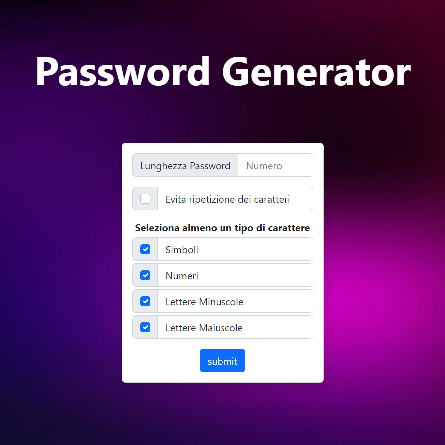
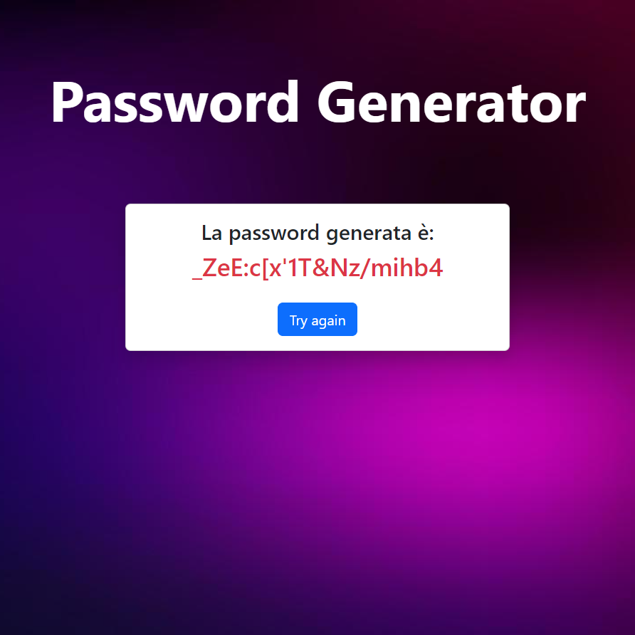
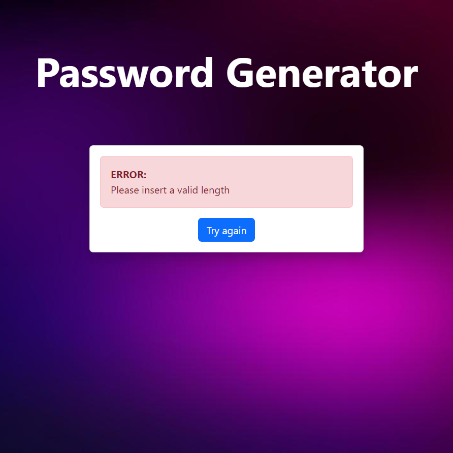

# Descrizione

Interfaccia utente capace di genera una stringa di caratteri casuali, è possibile selezionare alcuni parametri desiderati come la lunghezza della stringa, l'insieme dei caratteri di partenza e la possibilità di inserire caratteri ripetuti.

  
  
  

## Milestone

-   Ho creato un form che invii in GET la lunghezza della password.
-   Ho creatp una funzione iniziale che usando questo unico dato generava una password casuale (composta da lettere, lettere maiuscole, numeri e simboli).
-   Inizialmente ho scrittto tutto il codice (logica e layout) in un unico file `index.php`, successivamente una volta verificato il corretto funzionamento, ho spostato spostiamo la logica in un file `functions.php` che ho incluso nella pagina principale.
-   Invece di visualizzare la password nella index, ho effettuato un `redirect` ad una pagina dedicata che tramite `$\_SESSION` recupererà la password da mostrare all’utente.
-   Ho aggiunto la possibilità di generare la password scegliendo una combinazione a piacere tra questi set di caratteri: numeri, lettere e simboli.
-   Ho aggiunto la possibilità di generare password che evitino la ripetizione di caratteri uguali.
